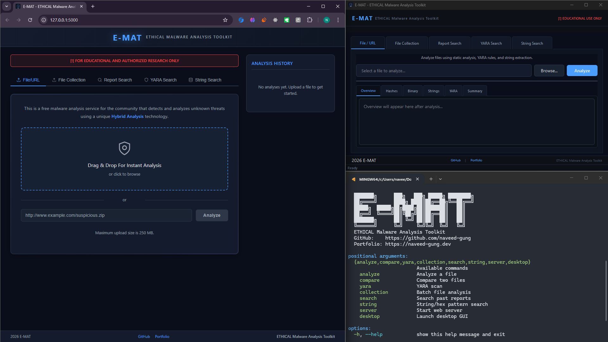

# E.MAT - ETHICAL Malware Analysis Toolkit

<div align="center">

```
███████╗      ███╗   ███╗ █████╗ ████████╗
██╔════╝      ████╗ ████║██╔══██╗╚══██╔══╝
█████╗  █████╗██╔████╔██║███████║   ██║   
██╔══╝  ╚════╝██║╚██╔╝██║██╔══██║   ██║   
███████╗      ██║ ╚═╝ ██║██║  ██║   ██║   
╚══════╝      ╚═╝     ╚═╝╚═╝  ╚═╝   ╚═╝   
```

**ETHICAL Malware Analysis Toolkit**

A modular, educational cybersecurity analysis framework with three interfaces — CLI, Desktop GUI, and Web




</div>

---

## Overview

E.MAT is a comprehensive malware analysis toolkit designed for **educational and authorized research purposes only**. It provides three distinct interfaces for analyzing potentially malicious files in a safe, controlled environment. A single smart launcher (`emat.py`) manages all three interfaces, handles virtual environment activation, dependency installation, and persistent user preferences.

### Ethical Warning

> **FOR EDUCATIONAL AND AUTHORIZED RESEARCH ONLY**
>
> This toolkit is designed for defensive cybersecurity education. Misuse for unauthorized activities is strictly prohibited and may be illegal. All interfaces display ethical disclaimers and require user confirmation before analysis.

---

## Features

### Three Interfaces

| Interface | Technology | Description |
|-----------|-----------|-------------|
| **CLI** | Python / argparse | Fast, scriptable command-line with colored output and JSON export |
| **Desktop** | PyQt6 | Dark-themed GUI with 5 tabbed panels and background workers |
| **Web** | Flask + REST API | Browser-based UI with drag-and-drop upload, history sidebar, and 5 tabs |

All three interfaces share the same **CORE_ENGINE** for consistent analysis results.

### Analysis Capabilities

- **PE Analysis** — Windows executable structure: imports, exports, sections, compile timestamp, entry point, architecture
- **ELF Analysis** — Linux binary analysis: dependencies, symbols, class, type, entry point
- **Document Analysis** — PDF and Office file analysis: metadata extraction, suspicious element detection, macro analysis
- **String Extraction** — Categorized strings with statistics: URLs, IP addresses, file paths, suspicious keywords
- **YARA Scanning** — Built-in educational rules + custom rule support with severity levels and educational notes
- **File Hashing** — MD5, SHA1, SHA256, SHA512, SSDEEP
- **Entropy Analysis** — Packer/encryption detection with educational context
- **Educational Summary** — AI-generated assessment with suggested learning topics for each analysis

### Five Functional Tabs (Desktop & Web)

1. **File / URL** — Single file analysis with sub-tabs: Overview, Hashes, Binary, Strings, YARA, Summary
2. **File Collection** — Batch upload and analyze multiple files at once
3. **Report Search** — Search past analysis reports by hash, filename, MIME type, or keyword
4. **YARA Search** — Scan any file against YARA rules (default or custom)
5. **String Search** — Hunt for ASCII and hex patterns at the byte level with offset and context

### CLI Commands

| Command | Description |
|---------|-------------|
| `analyze <file>` | Full static analysis with optional `--json` and `--report` output |
| `compare <file1> <file2>` | Side-by-side file comparison |
| `yara <file> --rules <path>` | YARA rule scanning |
| `collection <f1> <f2> ...` | Batch file analysis |
| `search --hash/--name/--query` | Search past report history |
| `string <file> --pattern <p>` | String and hex pattern search |
| `server --start` | Launch the Flask web server |
| `desktop` | Launch the PyQt6 desktop GUI |

### Web API Endpoints

| Method | Endpoint | Description |
|--------|----------|-------------|
| `GET` | `/` | Web UI (5-tab interface with history sidebar) |
| `GET` | `/api/health` | Health check |
| `POST` | `/api/analyze` | Single file analysis (multipart upload) |
| `POST` | `/api/collection` | Batch file analysis (multiple files) |
| `GET` | `/api/search/report?q=` | Search past reports |
| `POST` | `/api/yara/search` | YARA rule scan (upload rule file + target) |
| `POST` | `/api/string/search` | String/hex pattern search |
| `GET` | `/api/info` | API information |

### Safety & Security

- **Automatic venv detection** — The launcher creates and activates a virtual environment automatically
- **Static analysis by default** — No code execution; safe to run on suspicious files
- **Safety checker** — File size limits and pre-analysis safety validation
- **Ethical confirmation dialogs** — Required before every analysis in Desktop and Web
- **Docker sandbox** — Optional containerized dynamic analysis with network isolation
- **Report history** — Persistent JSON-based history for all analyses

---

## Quick Start

### Prerequisites

- Python 3.8 or higher
- Git

### Installation

```bash
# Clone repository
git clone https://github.com/naveed-gung/e.mat-toolkit.git
cd e.mat-toolkit

# Create virtual environment
python -m venv venv

# Activate virtual environment
source venv/Scripts/activate  # Git Bash / Linux / macOS
venv\Scripts\activate         # Windows CMD

# Install all dependencies
pip install -r requirements.txt
```

The `requirements.txt` is organized into sections: `[core]`, `[desktop]`, and `[web]`. The smart launcher can install only the packages needed for your chosen interface.

### Interactive Mode

```bash
python emat.py
```

Running without arguments launches the **interactive menu** where you can choose your interface, save preferences, and view usage history.

### Direct CLI Usage

```bash
# Analyze a file
python emat.py analyze sample.exe

# JSON output
python emat.py analyze sample.exe --json

# Compare two files
python emat.py compare file1.exe file2.exe

# YARA scan with custom rules
python emat.py yara sample.exe --rules DATA/yara_rules/

# Batch analysis
python emat.py collection file1.exe file2.dll file3.pdf

# Search past reports
python emat.py search --hash e3b0c44298fc1c149afbf4c8996fb924

# String pattern search
python emat.py string sample.exe --pattern "http://"

# Show all commands
python emat.py --help
```

### Launch Desktop GUI

```bash
python emat.py desktop
```

### Launch Web Server

```bash
python emat.py server --start --port 5000
# Open http://localhost:5000 in your browser
```

---

## Project Structure

```
e.mat-toolkit/
├── emat.py                    # Smart launcher (interactive menu, CLI args, venv management)
├── __main__.py                # Thin wrapper → calls emat.main()
├── requirements.txt           # Sectioned dependencies: [core], [desktop], [web]
├── setup.py                   # Package distribution config
│
├── CORE_ENGINE/               # Shared analysis engine used by all interfaces
│   ├── analyzers/
│   │   └── static/
│   │       ├── pe_analyzer.py        # Windows PE file analysis
│   │       ├── elf_analyzer.py       # Linux ELF binary analysis
│   │       ├── document_analyzer.py  # PDF & Office document analysis
│   │       └── string_analyzer.py    # Categorized string extraction
│   ├── config/                       # Preferences & first-run setup
│   └── utils/
│       ├── hashing.py               # MD5, SHA1, SHA256, SHA512, SSDEEP
│       ├── safety_checker.py        # File safety validation
│       ├── yara_manager.py          # YARA rule compilation & scanning
│       └── cli_theme.py             # Colored CLI output formatting
│
├── CLI_TOOL/                  # Command-line interface
│   └── commands/
│       ├── analyze.py               # Single file analysis (core logic)
│       ├── compare.py               # File comparison
│       ├── yara_scan.py             # YARA scanning command
│       ├── collection.py            # Batch file analysis
│       ├── search.py                # Report history search
│       └── string_search.py         # String/hex pattern search
│
├── DESKTOP_APP/               # PyQt6 desktop GUI
│   ├── main_window.py               # Main window with 5 tabs + background workers
│   └── styles/
│       └── dark_theme.qss           # Dark theme stylesheet
│
├── WEB_SERVICE/               # Flask web interface
│   ├── app.py                       # Flask app with REST API endpoints
│   ├── templates/
│   │   └── index.html               # 5-tab web UI with history sidebar
│   └── static/
│       ├── css/style.css            # Dark theme CSS
│       └── js/main.js              # Tab switching, uploads, results display
│
├── DOCKER_CONFIG/             # Docker sandbox for dynamic analysis
│   ├── Dockerfile                   # Container image definition
│   └── docker-compose.yml           # Service orchestration
│
├── DATA/                      # YARA rules and report history
│   └── yara_rules/                  # Educational YARA rule files
│
├── ASSETS/                    # Logo and branding assets
├── DOCUMENTATION/             # Guides and tutorials
└── TESTS/                     # Unit tests and safe sample files
```

---

## Smart Launcher (`emat.py`)

The unified launcher provides:

- **Interactive menu** — Choose CLI, Desktop, or Web with a single command
- **Persistent preferences** — Saves your preferred interface in `.emat_config.json`
- **Usage history** — Tracks recent sessions with timestamps
- **Auto venv activation** — Detects and activates the virtual environment automatically
- **Selective dependency install** — Installs only the packages needed for your chosen interface
- **Backwards-compatible CLI** — All original commands (`analyze`, `compare`, `yara`, `server`, `desktop`) still work

---

## Dependencies

### Core (all interfaces)

| Package | Purpose |
|---------|---------|
| `pefile` | Windows PE file parsing |
| `yara-python` | YARA rule engine |
| `pyelftools` | Linux ELF binary parsing |
| `oletools` | Office document macro analysis |
| `pdfminer.six` | PDF content extraction |
| `capstone` | Disassembly engine |
| `python-magic` | File type detection |
| `scikit-learn` | ML-based analysis features |
| `colorama` | Colored terminal output |
| `tabulate` | Table formatting |
| `click` | CLI framework |
| `Jinja2` | Template rendering |

### Desktop

| Package | Purpose |
|---------|---------|
| `PyQt6` | Desktop GUI framework |

### Web

| Package | Purpose |
|---------|---------|
| `Flask` | Web framework and REST API |
| `Flask-CORS` | Cross-origin request support |

---

## Documentation

- [Getting Started Guide](DOCUMENTATION/02_GETTING_STARTED.md)
- [Docker Sandbox Guide](DOCKER_CONFIG/README.md)

---

## Ethical Use

**DO:**
- Use for educational purposes
- Analyze files you have legal authorization to analyze
- Learn defensive cybersecurity concepts
- Report findings through proper channels

**DON'T:**
- Analyze files without authorization
- Use for malicious purposes
- Share real malware samples
- Violate any laws or regulations

---

## Author

**Naveed Gung**

- GitHub: [@naveed-gung](https://github.com/naveed-gung)
- Portfolio: [naveed-gung.dev](https://naveed-gung.dev)

## License

MIT License — See [LICENSE](LICENSE) file for details.

---

<div align="center">

**E.MAT v1.0** | Built with Python | For Educational Use Only

[GitHub](https://github.com/naveed-gung) | [Portfolio](https://naveed-gung.dev)

</div>
